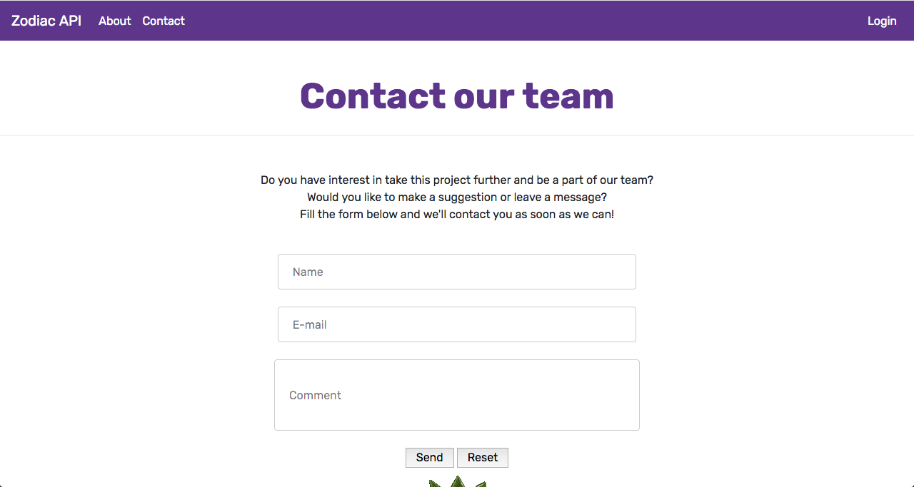

# API FINAL PROJECT
Final project - Zodiac signs info API

# You can find our front-end here: https://floresthela.github.io/ZodiacAPI/

## In the main page you can see your options in the navbar, you can go to an About, Contact and admin Login 

## About page

## Contact page

## Login page

## Admin view page

## Admin tables for star, rising and moon signs, you can ADD and DELETE according to each button, and UPDATE some of the attributes on each sign by just clicking on it, editing and hitting ENTER

